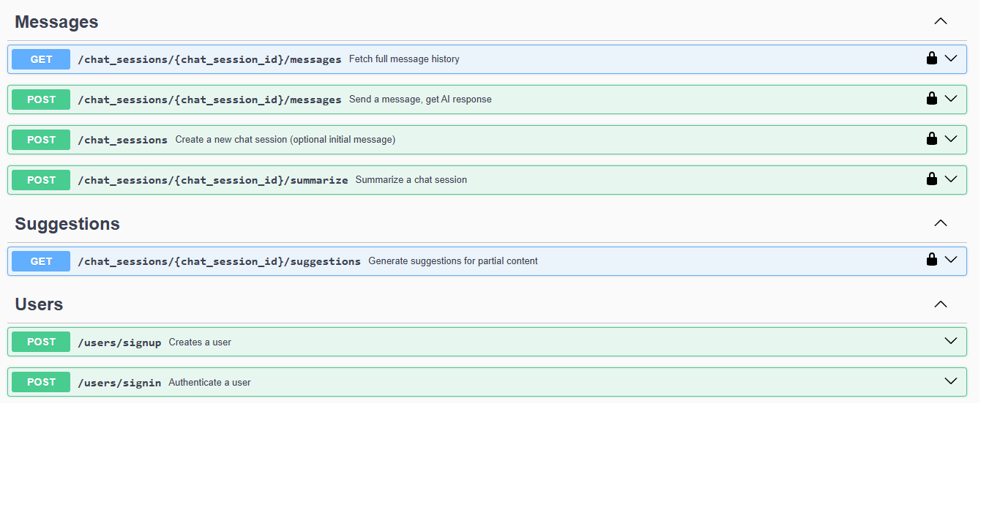
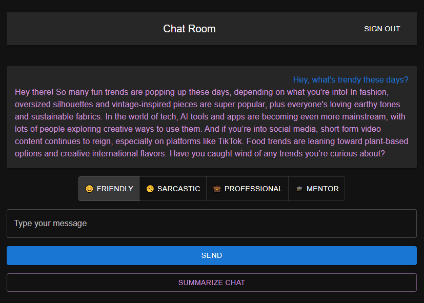
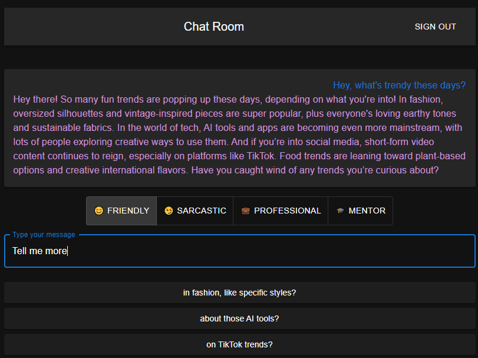

# AI Chat Companion

A full-stack AI chat platform built with Rails 8 (API backend) and React (frontend).

It experiments with conversational AI patterns, memory checkpoints, tone-shifting system prompts, and predictive message suggestions to create a chat experience that feels smarter and more personal.

---

## Features


- **Message Summarization**: condenses conversation history into short, neutral summaries that keep context without flooding the AI.

- **System Prompts / Personalities**: switch AI voice' between different tones (friendly, sarcastic, professional, mentor).

- **Message Suggestions (Auto-complete)**: as you type, the AI suggests 2–3 continuations you might want to say next.

- **Conversation Memory**: instead of passing the entire history, the backend uses checkpoint summaries to maintain long-term context efficiently.

---

## Tech Stack

- **Backend: Ruby on Rails, PostgreSQL**
- **Frontend: React**
- **AI Integration: OpenRouter**

---

## Setup Instructions


```bash

# Clone the repo
git clone git@github.com:anthony-devhub/chatbot.git
cd chatbot

```

### Backend

```bash

# Get into Rails folder
cd backend

# Install dependencies & setup DB
bin/setup

# Run the server
bin/dev

```

### Frontend

```bash

# Get into React folder
cd ../frontend

# Install dependencies
npm install

# Run the server
npm run dev

```

---

## API Documentation (Swagger)

Here's a preview:



---

## Screenshots





## Author

**Anthony Salim**

Ruby on Rails Developer

🇮🇩 Indonesia | 🌐 Open to remote roles.

Let’s build something cool together!

📧 anthonysalim.dev@gmail.com